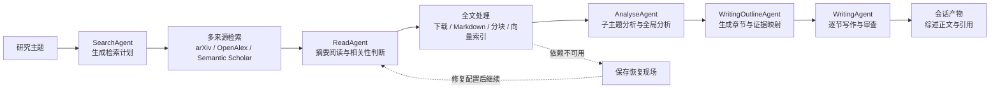

<div align="center">

# Paper-Agent

**面向论文检索、阅读、分析与综述写作的多智能体科研工作台**

输入一个研究主题，让一组职责清晰的 Agent 完成从找论文到写综述正文的完整流程。

[](https://www.python.org/)
[](https://fastapi.tiangolo.com/)
[](https://vuejs.org/)
[](https://langchain-ai.github.io/langgraph/)
[](https://docs.astral.sh/uv/)

[快速开始](#快速开始) · [工作流](#工作流) · [模型配置](#模型配置) · [开发指南](#开发指南)

</div>

---

## 项目简介

Paper-Agent 是一个面向科研人员、学生和论文写作者的本地优先学术调研工具。它不只是返回一串搜索结果，而是把一次综述任务拆成多个可以观察、保存和恢复的阶段：

> **检索论文 → 阅读摘要与全文 → 分析研究现状 → 生成写作大纲 → 按证据写作 → 输出综述结果**

系统通过 Web 工作台发起会话，后端使用 LangGraph 编排流程，模型调用由统一的 LLM 适配层负责，论文元数据、阅读笔记、分析报告和写作产物会按会话保存到本地。

### 它适合什么场景

| 使用场景 | Paper-Agent 提供的帮助 |
| --- | --- |
| 初步了解陌生研究方向 | 从多个学术来源检索论文，按主题和约束去重、筛选和整理 |
| 论文阅读与资料积累 | 先读摘要判断相关性，再按条件下载全文、解析、切分并建立本地资料 |
| 撰写领域综述 | 从子主题分析和全局分析生成结构化大纲，再逐节生成正文 |
| 长任务过程管理 | 会话、运行状态、阶段产物和实时进度都可在工作台中查看 |
| 模型与成本控制 | 不同阶段可以使用不同模型档位，并展示实际 token 用量 |

Paper-Agent 生成的是研究辅助结果，不替代作者对论文原文、引用关系和结论可靠性的最终判断。

## 核心能力

### 多来源论文检索

内置以下检索连接器，并将不同来源的记录统一为 `PaperDocument`：

- `arXiv`
- `OpenAlex`
- `Semantic Scholar`

检索阶段会先由 `SearchAgent` 根据研究主题生成关键词和子主题，再由检索服务完成来源适配。系统支持按年份、来源、数量和排除词筛选，并会对多来源结果进行去重和评分。

### 从摘要到全文的渐进式阅读

`ReadAgent` 先根据标题和摘要生成阅读笔记、相关性判断和阅读提醒。满足条件的论文会继续进入全文处理流程：

1. 下载 PDF 或网页全文；
2. 使用 `pypdf` 转换为 Markdown；
3. 将 Markdown 切分为可检索片段；
4. 抽取结构化论文信息；
5. 使用 embedding 配置写入本地 Chroma 向量库。

模型、下载或向量服务暂时不可用时，阅读节点会保存恢复现场。修复配置后，可以从会话中继续处理，不必从头重新检索。

### 分层研究分析

`AnalyseAgent` 会先按检索子主题分析论文，再对各子主题结果做全局综合，形成研究现状、共识、争议、研究空白、时间演化、方法演化和研究展望等结构化内容。

### 证据约束下的综述写作

写作流程分为两步：

- `WritingOutlineAgent` 根据分析结果生成章节、小节、写作任务、证据映射和前置小节引用关系；
- `WritingAgent` 按大纲逐节写作，在证据不足时调用检索工具补充资料，完成后进行审查和有限次数修改。

最终写作产物包含正文、摘要、引用到的 `paperId`、工具结果、审查结果和警告信息，方便继续人工编辑。

### 实时会话工作台

前端通过 SSE 订阅一次运行的实时事件，可以看到检索、阅读、分析、大纲和逐节写作的进度。会话和产物使用 SQLite 加文件系统持久化，浏览器刷新后仍然可以读取历史线程。

### 可视化模型配置

系统设置页支持管理：

- Provider 的协议类型、API 地址、密钥和调用参数；
- `default_agent`、`luna_agent`、`solar_agent` 三个 Agent 模型档位；
- embedding 模型及维度、批量大小；
- Provider 可用模型目录查询；
- Agent 与 embedding 的真实连通性测试。

配置保存后会在下一次请求中生效，不需要重启后端。

## 工作流



## 技术栈

| 层级 | 技术 |
| --- | --- |
| 运行时 | Python 3.12+、`uv`、Uvicorn |
| 后端 API | FastAPI、REST、Server-Sent Events（SSE） |
| 工作流 | LangGraph、TypedDict 共享状态 |
| Agent | Search、Read、Analyse、Writing Outline、Writing |
| LLM 适配 | OpenAI 风格兼容协议、Anthropic Messages 协议 |
| 论文来源 | arXiv、OpenAlex、Semantic Scholar |
| 全文处理 | `pypdf`、Markdown 转换、文本分块 |
| 向量检索 | ChromaDB |
| 会话存储 | SQLite + 本地 JSON/Markdown/向量文件 |
| 前端 | Vue 3、TypeScript、Vite、Vue Router、Lucide |

## 快速开始

### 运行环境

- Python 3.12 或更高版本；
- [uv](https://docs.astral.sh/uv/)；
- Node.js 18 或更高版本；
- 可以访问模型服务和论文来源的网络；
- 至少一个可用的 LLM Provider；
- 如果需要全文向量索引，还需要配置 embedding Provider。

### 1. 安装项目依赖

在项目根目录执行：

```powershell
uv init
uv venv --python 3.12
uv sync
npm run front:install
```

如果你已经有可用的 Python 3.12 虚拟环境，也可以直接执行 `uv sync` 和 `npm run front:install`。

### 2. 创建本地模型配置

可以通过 Web UI 工作台的「系统设置」页面修改和测试配置。（推荐）

或按照下面方法手动编辑配置文件

拷贝一份config\model.example.json到config/model.json中。

编辑 `config/model.json`，至少确认以下内容：

1. `providers` 中存在一个可用 Provider，并填写 `api_base`；
2. `api_key` 或 `api_key_env` 能提供有效密钥；
3. `agents.default_agent` 已配置；
4. `embedding_profiles.default_embedding` 已指向可用的 embedding Provider。

### 3. 启动后端

打开一个终端：

```powershell
uv run python main.py
```

后端默认监听 `127.0.0.1:8000`，开发模式会自动重载。启动后可以访问：

- API 文档：<http://127.0.0.1:8000/docs>

### 4. 启动前端

打开第二个终端，在项目根目录执行：

```powershell
npm run front:dev
```

打开 <http://127.0.0.1:5173/>，进入「系统设置」测试模型，再进入会话工作台创建研究任务。

前端开发服务器默认只监听本机，并将 `/api` 和 `/webui` 请求代理到 `127.0.0.1:8000`。如果要让同一局域网里的其他设备访问：

```powershell
npm run front:dev:network
```

## 模型配置

### 配置文件分工

| 文件 | 作用 | 是否建议提交 |
| --- | --- | --- |
| `config/settings.example.json` | 不含密钥的配置模板 | 是 |
| `config/model.json` | 当前机器实际使用的 Provider、Agent 和 embedding 配置 | 否，已忽略 |
| `config/system.yaml` | LLM 默认值、全文阅读、缓存和向量库参数 | 是 |

### Agent 与模型档位

后端节点使用固定的三个模型档位。它们是配置名，不是具体厂商模型名：

| Agent | 默认档位 | 主要职责 |
| --- | --- | --- |
| `SearchAgent` | `luna_agent` | 从研究主题生成关键词、子主题和检索约束 |
| `ReadAgent` | `default_agent` | 读取摘要，判断相关性并整理笔记 |
| `AnalyseAgent` | `solar_agent` | 分析子主题，并综合研究现状与趋势 |
| `WritingOutlineAgent` | `default_agent` | 生成正文大纲和证据映射 |
| `WritingAgent` | `default_agent` | 逐节写作、调用资料工具和审查修改 |

如果没有配置 `luna_agent` 或 `solar_agent`，模型工厂会回退到必需的 `default_agent`。`default_agent` 缺失时，配置无法正常工作。

### Provider 后端

当前 LLM 适配层支持以下 `backend`：

- `openai`：OpenAI 官方风格配置；
- `openai_compat`：OpenAI Chat Completions 兼容服务；
- `anthropic`：Anthropic Messages 协议；
- `anthropic_compat`：Anthropic 兼容服务。

Provider 配置常用字段如下：

```json
{
  "providers": {
    "my_provider": {
      "backend": "openai_compat",
      "api_key_env": "OPENAI_API_KEY",
      "api_base": "https://api.openai.com/v1",
      "extra_headers": {},
      "extra_body": {}
    }
  }
}
```

其中 `api_key` 和 `api_key_env` 二选一即可。使用兼容网关时，通常需要同时填写 `backend`、`api_base` 和模型名称。

### 系统参数

`config/system.yaml` 中的参数主要影响阅读节点：

| 参数 | 作用 |
| --- | --- |
| `read.paper_cache_dir` | PDF、Markdown、抽取结果和分块文件的缓存目录 |
| `read.deep_score_threshold` | 触发全文精读的相关性分数阈值 |
| `read.connect_timeout_seconds` | 连接论文来源的超时时间 |
| `read.download_timeout_seconds` | 下载全文的超时时间 |
| `read.max_file_size_mb` | 允许下载的最大文件大小 |
| `read.chunk_size` | 文本分块长度 |
| `read.chunk_overlap` | 相邻文本块的重叠长度 |
| `read.vector_store_path` | Chroma 向量库路径 |
| `read.vector_store_collection` | 向量集合名称 |

## 项目结构

```text
Paper-Agent/
├── main.py                         # FastAPI 本地启动入口
├── pyproject.toml                  # Python 项目元数据与依赖
├── package.json                    # 根目录前端快捷命令
├── config/
│   ├── model.json                  # 本地模型配置，不提交
│   ├── settings.example.json       # 模型配置示例
│   └── system.yaml                 # 系统默认参数
├── front/                          # Vue 3 + TypeScript 前端
│   ├── src/api/                    # 会话与设置 API 客户端
│   ├── src/components/             # 工作台、状态和会话组件
│   ├── src/views/                  # 会话工作台、系统设置页
│   └── vite.config.ts              # 开发服务器、代理和端口配置
├── src/
│   ├── agents/                     # Agent 定义、模型调用和写作工具
│   ├── api/                        # FastAPI 应用与路由
│   ├── graph/                      # LangGraph 主流程和各阶段节点
│   ├── llm/                        # Provider 适配、配置解析和统一响应
│   ├── models/                     # 会话、协议和阅读领域模型
│   ├── paper_retrieval/             # 论文模型、检索服务和来源连接器
│   ├── repositories/               # SQLite、JSON、Chroma 与阶段产物持久化
│   ├── services/                   # 会话、运行、设置和工作流服务
│   └── utils/                      # 日志、缓存、全文解析和分块工具
├── data/                           # 本地数据库、论文缓存、会话和向量数据
├── logs/                           # 运行日志
└── test/                           # unittest 测试与联调辅助代码
```

## 参与贡献

欢迎提交 Issue 和 Pull Request。建议贡献前先完成：

1. 在 `test/` 中补充或更新对应行为的测试；
2. 运行 `uv run python -m unittest discover -s test -v`；
3. 运行 `npm run front:build`，确保前端类型检查和构建通过；
4. 在 PR 描述中说明改动范围、配置影响和复现步骤。

项目地址：<https://github.com/Tswoen/Paper-Agent>

---

<div align="center">

**让论文检索更快，让研究脉络更清楚。**

</div>
