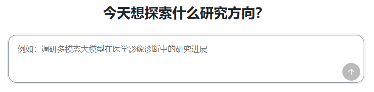
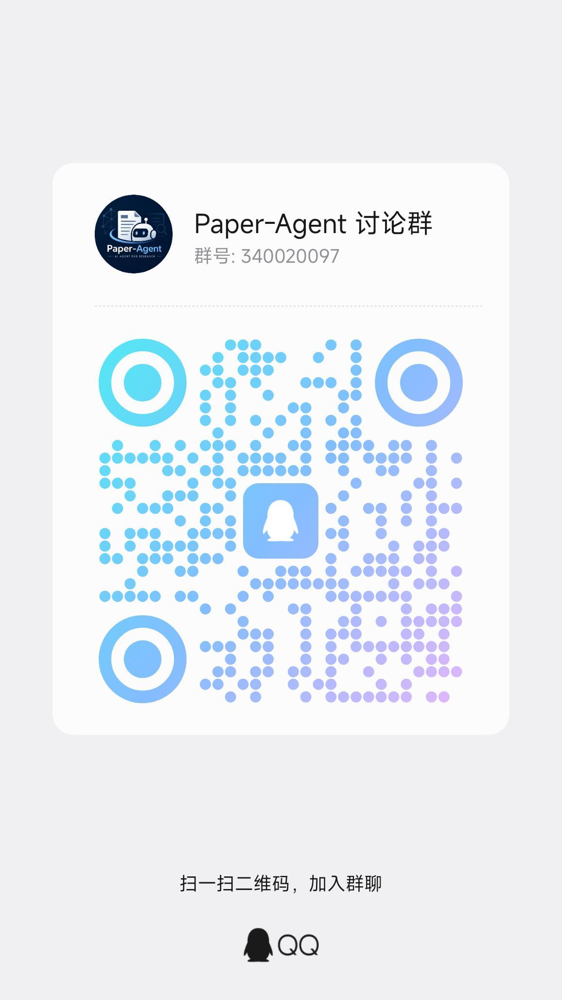

<div align="center">

# Paper-Agent · Intelligent Academic Survey Report Generator

**Turn a research topic into an in-depth domain survey report**

[](https://python.org)
[](https://react.dev)
[](https://fastapi.tiangolo.com)
[](https://microsoft.github.io/autogen)
[](https://langchain-ai.github.io/langgraph)
[](../LICENSE)
[](https://github.com/Tswoen/Paper-Agent/pulls)

<p align="center">
  <b>English</b> · <a href="../README.md">简体中文</a>
</p>

</div>

---

## 👀 Interface Overview

<p align="center">
  
  <br>
  <em>Enter a research topic and track the full pipeline — search → reading → analysis → writing — in real time</em>
</p>

---

## 🎯 Why Paper-Agent?

If you have ever done academic research, you know the pain:

| Scenario | Traditional Approach | **Paper-Agent** |
|----------|---------------------|-----------------|
| Exploring an unfamiliar field from scratch | Manually search → read 20+ papers → take notes → organize, **takes 1~2 weeks** | Input a research topic, get a structured survey report in **5 minutes** |
| Writing a survey report | Read and write iteratively, restructure repeatedly, **often start over halfway** | Auto-generate outline → parallel chapter writing → reviewer quality gate, **done in one pass** |
| Identifying research trends | Relies on personal experience, **prone to overlooking important directions** | KMeans clustering + deep analysis + global analysis, **data-driven insight discovery** |
| Discussing papers with ChatGPT | Single-turn dialog, **no systematic organization**, fragmented output | Multi-agent pipeline, **search → read → analyze → write** fully automated |

> **Paper-Agent is not a paper summarizer — it is a complete AI research assistant that reads papers, understands trends, and writes reports.**

---

## ✨ Core Features

| | Feature | In a Nutshell |
|--|---------|---------------|
| 🤖 | **Multi-Agent Pipeline** | Search / Reader / Cluster / DeepAnalyse / Writer / Reviewer — like a research team working autonomously |
| 🔬 | **3-Stage Deep Domain Analysis** | Cluster analysis → per-cluster deep dive → 6-module global overview, from micro to macro |
| ⚡ | **Parallel Writing + Quality Review** | Writing director splits the outline, multiple writing groups work in parallel, Reviewer approves each chapter |
| 📡 | **Real-Time SSE Streaming** | Every step from search to report is streamed to the web UI in real time |
| 🧠 | **Retrieval-Augmented Writing (RAG)** | ChromaDB stores structured paper data, automatically retrieved during writing |
| 🎛️ | **Web-Based Configuration** | Manage multiple model providers, assign models per agent, test connectivity — all from the browser |

---

## 📦 Tech Stack

| Layer | Technology |
|-------|-----------|
| **AI Framework** | AutoGen, LangGraph, LangChain |
| **Backend** | Python 3.12+, FastAPI, Uvicorn, SSE |
| **Vector Database** | ChromaDB |
| **Machine Learning** | scikit-learn (KMeans, Elbow Method), NumPy |
| **Frontend** | React 19, TypeScript, Vite 7 |
| **Paper Retrieval** | arXiv API, aiohttp |
| **PDF Parsing** | PyMuPDF (fitz) |
| **Package Manager** | Poetry (Python) / npm (Web) |
| **LLM Compatible** | OpenAI, SiliconFlow, DashScope, Ark, and OpenAI-compatible endpoints |

> 🧠 For detailed system design documentation, see [`design.md`](../design.md)

### 📂 Project Structure

```text
Paper-Agent/
├── main.py                 # Application entry, FastAPI initialization
├── pyproject.toml          # Python project config & dependencies
├── LICENSE                 # MIT license
├── README.md               # Chinese documentation
├── design.md               # System design document
├── .gitignore
│
├── docs/
│   └── README_en.md        # English documentation
│
├── src/                    # Python source code
│   ├── agents/             # Agent modules
│   │   ├── orchestrator.py         # Workflow orchestrator
│   │   ├── search_agent.py         # Paper search agent
│   │   ├── userproxy_agent.py      # User review proxy
│   │   ├── reading_agent.py        # Paper reading agent
│   │   ├── analyse_agent.py        # Paper analysis agent
│   │   ├── writing_agent.py        # Content writing agent
│   │   ├── report_agent.py         # Report generation agent
│   │   ├── sub_analyse_agent/
│   │   │   ├── cluster_agent.py
│   │   │   ├── deep_analyse_agent.py
│   │   │   └── global_analyse_agent.py
│   │   └── sub_writing_agent/
│   │       ├── writing_director_agent.py
│   │       ├── parallel_writing_node.py
│   │       ├── writing_agent.py
│   │       ├── retrieval_agent.py
│   │       ├── review_agent.py
│   │       ├── writing_chatGroup.py
│   │       └── writing_state_models.py
│   │
│   ├── core/               # Core infrastructure
│   │   ├── config.py        # Configuration management
│   │   ├── config_router.py # Config API routes
│   │   ├── model_client.py  # LLM/Embedding client factory
│   │   ├── models.yaml      # Model provider configuration
│   │   ├── system_params.yaml
│   │   ├── prompts.py       # Prompt templates
│   │   └── state_models.py  # Pydantic state models
│   │
│   ├── services/
│   │   ├── chroma_client.py
│   │   └── retrieval_tool.py
│   │
│   ├── knowledge/
│   │   ├── knowledge_router.py
│   │   └── knowledge/
│   │
│   ├── tasks/
│   │   └── paper_search.py
│   │
│   ├── plugins/
│   │
│   └── utils/
│       └── log_utils.py
│
├── web/                    # React frontend
│   ├── index.html
│   ├── package.json
│   ├── vite.config.ts
│   ├── tsconfig.json
│   └── src/
│       ├── main.tsx
│       ├── App.tsx
│       ├── styles.css
│       ├── api/
│       │   ├── config.ts
│       │   ├── knowledge.ts
│       │   └── knowledge.test.ts
│       ├── features/
│       │   ├── research/
│       │   ├── config/
│       │   ├── knowledge/
│       │   └── history/
│       └── test/
│           └── setup.ts
│
├── test/                   # Python tests
│   ├── test_analyseAgent.py
│   ├── test_readingAgent.py
│   ├── test_searchAgent.py
│   ├── test_writingAgent.py
│   └── test_workflow.py
│
├── data/                   # Data storage
└── output/                 # Output directory
    └── log/
```

---

## 🚀 Quick Start

```bash
# 1. Clone the repository
git clone https://github.com/Tswoen/Paper-Agent.git && cd Paper-Agent

# 2. Install Python dependencies
poetry install

# 3. Configure environment variables
cp example.env .env   # Fill in your API Key

# 4. Start the backend (default :8000)
poetry run python main.py

# 5. Start the frontend (default :5173, new terminal)
cd web && npm install && npm run dev
```

Open your browser at **http://localhost:5173**, enter your research topic, and start exploring.

> 💡 You can also configure API Keys through the web UI under "System Settings" — no need to manually edit `.env`.

### 🔧 Configuration

The system supports multiple model providers, with per-agent model assignment:

- Config file: `src/core/models.yaml`
- Web-based visual editor is the recommended way
- Supported providers: OpenAI / SiliconFlow / DashScope / Ark / any OpenAI-compatible service
- Assign different LLMs & embedding models per agent (search, reading, analysis, writing, report)
- One-click connectivity test for each model

---

## 💬 Community

Join the Paper-Agent community for updates, tips, and discussions:

<p align="center">
  
  <br>
  <em>（Join our QQ group for discussions）</em>
</p>

---

## ❤️ Special Thanks

Special thanks to **@GreatZack** for significant contributions to Paper-Agent:

<p align="center">
  <a href="https://github.com/GreatZack">
    
  </a>
  <br>
  <strong><a href="https://github.com/GreatZack">@GreatZack</a></strong>
</p>

---

## 🤝 Contributing

All forms of contributions are welcome, including but not limited to:

- Submit an [Issue](https://github.com/Tswoen/Paper-Agent/issues) to report bugs or suggest features
- Submit a [Pull Request](https://github.com/Tswoen/Paper-Agent/pulls) to improve the codebase
- Improve documentation or share your use cases

---

## 📄 License

[MIT](../LICENSE) © 2024 Tswoen

---

<div align="center">

**If Paper-Agent is helpful to your research, please give us a ⭐**

[](https://star-history.com/#Tswoen/Paper-Agent&Date)

</div>
